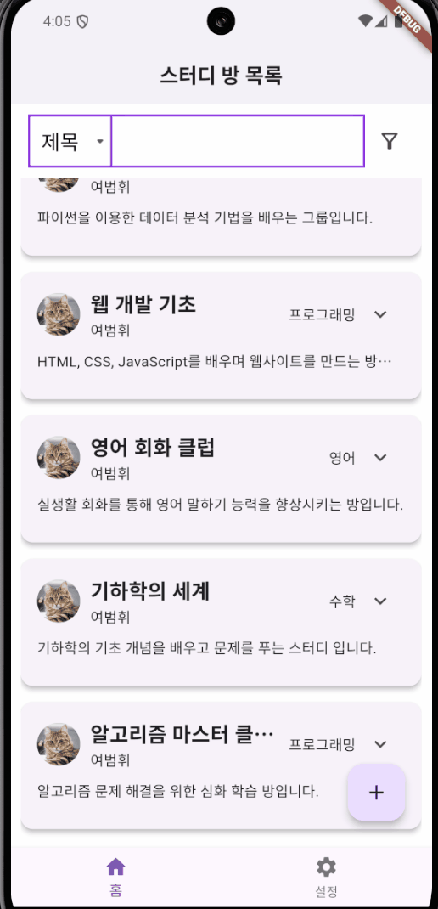
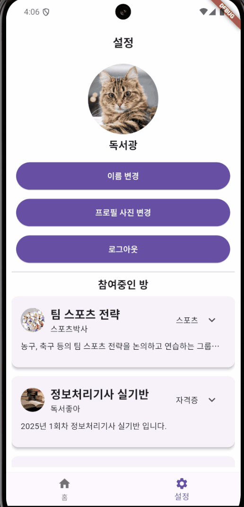
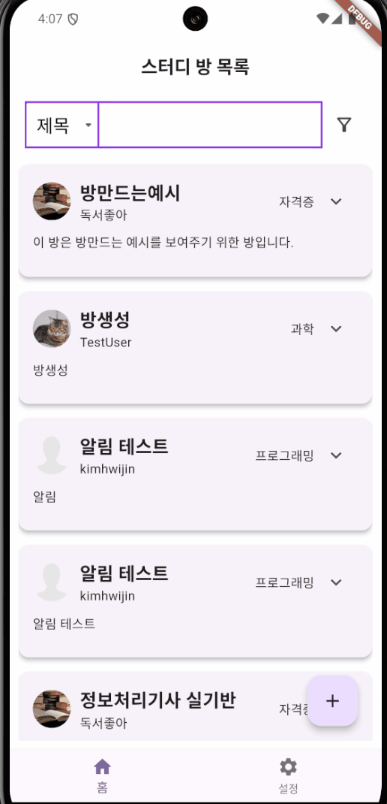

#  그룹 스터디 채팅방 프로젝트

이 프로젝트는 [엘리스](https://apptrack.elice.io/explore) Flutter 트랙 2기 1차 프로젝트로, 특정 시간에 시작되고 종료되는 채팅방과 모바일 알림 기능을 구현하는 것을 목표로 합니다. 그룹 스터디 채팅방을 주제로, 사용자가 원하는 시간에 채팅방을 예약하고 알림을 받을 수 있는 기능을 제공합니다.

## 목차 (Table of Contents)

- [프로젝트 소개](#프로젝트-소개)
- [기능](#기능)
- [설치 및 실행 방법](#설치-및-실행-방법)
- [요구사항](#요구사항)
- [주요 패키지 의존성](#주요-패키지-의존성)
- [사용 예시](#사용-예시)


## 프로젝트 소개

이 프로젝트는 사용자가 예약한 시간에 맞춰 채팅방에 입장하고 대화를 나눌 수 있는 기능을 제공합니다. 그룹 스터디 참여를 통해 스터디 시간을 더욱 효율적으로 관리할 수 있으며, 예약된 시간이 되면 자동으로 알림을 받게 됩니다. 또한, 각 채팅방에는 최대 참여 인원이 설정되어 있어, 인원 초과 시 참여가 제한됩니다.
## 기능

프로젝트의 주요 기능 목록을 간단히 나열합니다.

- **채팅방 예약**: 사용자가 원하는 스터디 그룹에 신청하여 스터디 채팅방을 예약할 수 있습니다.
- **모바일 알림**: 스터디 시작 시간이 다가오면 사용자에게 알림을 보냅니다.
- **채팅방 참여**: 예약된 시간에 맞춰 스터디 채팅방에 입장하여 대화에 참여할 수 있습니다.
- **인원 관리**: 각 채팅방에는 최대 참여 인원이 설정되어 있으며, 초과할 경우 참여가 제한됩니다.
- **프로필 관리**: 사용자가 자신의 프로필 사진 및 이름을 설정할 수 있습니다.

## 설치 및 실행 방법
1. 저장소를 클론합니다.
    ```bash
    git clone https://kdt-gitlab.elice.io/flutter_track/class02/project1/app_team2.git
    cd group-study-chat-room
    ```

2. Flutter 패키지를 설치합니다.
    ```bash
    flutter pub get
    ```

4. 애플리케이션을 실행합니다.
    ```bash
    flutter run
    ```

### 요구사항

- **Flutter**: 3.24.3
- **Dart**: 3.5.3


### 주요 패키지 의존성

- `shared_preferences: ^2.3.2`: 로컬 저장소에 간단한 데이터 저장을 위해 사용됩니다.
- `flutter_local_notifications: ^17.2.3`: 모바일 알림 기능을 위한 플러그인입니다.
- `socket_io_client: ^3.0.0`: 실시간 소켓 통신을 지원합니다.
- `timezone: ^0.9.4`: 타임존 관리를 위한 패키지입니다.
- `go_router: ^14.2.8`: 네비게이션과 라우팅을 위한 플러그인입니다.
- `http: ^1.2.2`: HTTP 요청을 쉽게 처리할 수 있습니다.
- `flutter_native_splash: ^2.4.1`: 네이티브 스플래시 화면을 설정하는 데 사용됩니다.
- `after_layout: ^1.2.0`: 위젯이 렌더링된 후 작업을 실행할 수 있게 합니다.
- `cupertino_icons: ^1.0.8`: iOS 스타일 아이콘을 제공하는 패키지입니다.
- `firebase_auth: ^5.3.1`: Firebase를 통한 인증 기능을 제공합니다.
- `firebase_core: ^3.6.0`: Firebase 초기화를 위한 패키지입니다.
- `cloud_firestore: ^5.4.4`: Firebase Cloud Firestore 데이터베이스와 통신합니다.
- `intl: ^0.19.0`: 날짜와 시간 등의 국제화 처리를 위한 패키지입니다.
- `flutter_staggered_grid_view: ^0.7.0`: 그리드 레이아웃을 위한 패키지입니다.
- `permission_handler: ^11.3.1`: 권한 관리를 위한 패키지입니다.
- `provider: ^6.1.2`: 상태 관리를 위한 패키지입니다.
- `firebase_storage: ^12.3.3`: Firebase Storage를 통해 파일을 저장하고 가져올 수 있습니다.
- `image_picker: ^1.1.2`: 갤러리나 카메라에서 이미지를 선택하기 위한 패키지입니다.

## 사용 예시

**로그인 예시**


**방 만들기 예시**



**프로필 관리 예시**




**채팅 예시**


