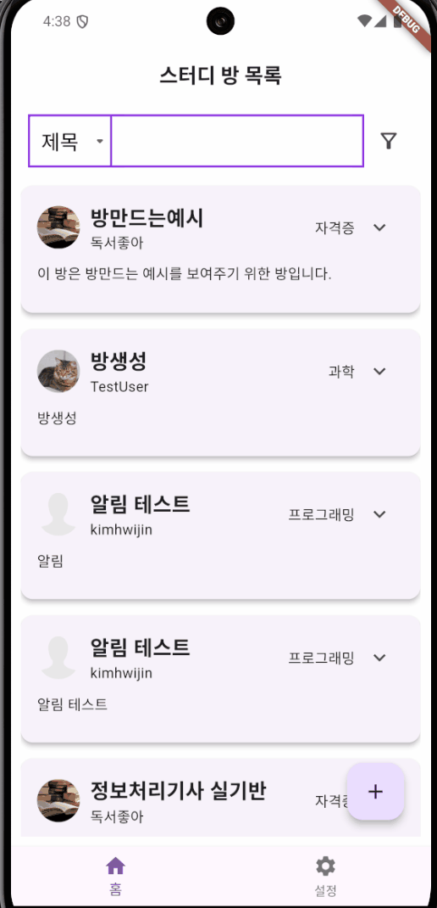

# Group Study Chat Room Project

This project is part of the [Elice](https://apptrack.elice.io/explore) Flutter Track 2 Phase 1 project, aimed at implementing chat rooms that start and end at specific times along with mobile notification features. Focusing on group study chat rooms, it provides functionality for users to reserve chat rooms at their desired times and receive notifications.

## Table of Contents

- [Project Introduction](#project-introduction)
- [Features](#features)
- [Installation and Execution Instructions](#installation-and-execution-instructions)
- [Requirements](#requirements)
- [Main Package Dependencies](#main-package-dependencies)
- [Usage Examples](#usage-examples)

## Project Introduction

This project offers functionality for users to enter chat rooms and engage in conversations at the scheduled time. By participating in group studies, users can manage study times more efficiently, and they will receive automatic notifications when the reserved time approaches. Additionally, each chat room has a maximum participant limit, restricting participation if exceeded.

## Features

Here’s a brief list of the main functionalities of the project:

- **Chat Room Reservation**: Users can apply to reserve study chat rooms for their desired study groups.
- **Mobile Notifications**: Users receive notifications as the study start time approaches.
- **Chat Room Participation**: Users can enter the study chat room at the scheduled time to participate in the conversation.
- **Participant Management**: Each chat room has a maximum number of participants, and participation is restricted if the limit is exceeded.
- **Profile Management**: Users can set their profile picture and name.

## Installation and Execution Instructions

1. Clone the repository.
    ```bash
    git clone https://kdt-gitlab.elice.io/flutter_track/class02/project1/app_team2.git
    cd group-study-chat-room
    ```

2. Install Flutter packages.
    ```bash
    flutter pub get
    ```

3. Run the application.
    ```bash
    flutter run
    ```

### Requirements

- **Flutter**: 3.24.3
- **Dart**: 3.5.3

### Main Package Dependencies

- `shared_preferences: ^2.3.2`: Used for simple data storage in local storage.
- `flutter_local_notifications: ^17.2.3`: Plugin for mobile notification features.
- `socket_io_client: ^3.0.0`: Supports real-time socket communication.
- `timezone: ^0.9.4`: Package for timezone management.
- `go_router: ^14.2.8`: Plugin for navigation and routing.
- `http: ^1.2.2`: Simplifies handling HTTP requests.
- `flutter_native_splash: ^2.4.1`: Used for setting up native splash screens.
- `after_layout: ^1.2.0`: Allows execution of tasks after widget rendering.
- `cupertino_icons: ^1.0.8`: Provides iOS style icons.
- `firebase_auth: ^5.3.1`: Provides authentication features via Firebase.
- `firebase_core: ^3.6.0`: Package for Firebase initialization.
- `cloud_firestore: ^5.4.4`: Communicates with the Firebase Cloud Firestore database.
- `intl: ^0.19.0`: Handles internationalization for dates, times, etc.
- `flutter_staggered_grid_view: ^0.7.0`: For grid layouts.
- `permission_handler: ^11.3.1`: For permission management.
- `provider: ^6.1.2`: For state management.
- `firebase_storage: ^12.3.3`: For saving and retrieving files through Firebase Storage.
- `image_picker: ^1.1.2`: For selecting images from the gallery or camera.

## Usage Examples

**Login Example**


**Room Creation Example**


**Profile Management Example**


**Chat Example**


**Topic Filtering Example**




## Team Introduction 

- **Yeo Beom-hwi**  
    - **Responsibilities**  
        - UI design and implementation  
        - Login screen and functionality  
        - Signup screen and functionality  
        - Database design  
        - Main screen and functionality  
        - Infinite scroll on the main screen  
        - Topic filtering screen and functionality  
        - Profile settings screen and functionality  

- **Kim Hwi-jin**  
    - **Responsibilities**  
        - Mobile notification functionality  
        - Reservation functionality  
        - Chat screen and functionality  
        - Search bar and functionality  
        - Navigation management using Go Router  
        - Profile settings screen and functionality  

## Database Structure

### Chats Table
- **RoomID**  (Document ID)  
  - **Messages** (Array)  
    - **Message_Text**: String  
    - **Sent_At**: Timestamp  
    - **User_ID**: String  

### reservations Table
- **RoomID** (Document ID)  
    - **Notification_Sent**: Boolean  
    - **Reservation_Time**: Timestamp  
    - **User_ID** (Array)  
        - **User_ID**: String  

### Study_rooms Table
- **Room_ID** (Document ID)  
  - **Content**: String  
  - **Create_Date**: Timestamp  
  - **End_Time**: Timestamp  
  - **Host**: String  
  - **Host_Profile_Image**: String  
  - **Max_Participants**: Number  
  - **Reservations** (Array)  
    - **User_ID**: String  
  - **Room_ID**: Number  
  - **Start_Study**: Boolean  
  - **Start_Time**: Timestamp  
  - **Title**: String  
  - **Topic**: String  

### Users Table
- **User_ID** (Document ID)  
  - **Email**: String  
  - **Name**: String  
  - **Participation_List** (Array)  
    - **Room_ID**: String  
  - **Profile_Image**: String  
